# Prism

<div align="center">
  
</div>

A modern desktop application for tracking application usage time, built with Electron and inspired by Steam's UI design.

## Why "Prism"?

Just like a prism breaks white light into a beautiful spectrum of colors, **Prism** breaks down your raw application usage data into colorful, actionable insights. The name reflects the app's core purpose: transforming simple time tracking into detailed analytics, trends, and productivity metrics—making the invisible visible.

## Features

- **Automatic Time Tracking** - Tracks all running applications automatically in the background
- **Steam-Inspired UI** - Clean, modern interface with familiar navigation patterns
- **Collections/Categories** - Organize apps into custom collections with colors and icons
- **Favorites System** - Quick access to your most-used applications
- **Daily Statistics** - View today's total usage time and app count at a glance
- **Search & Filter** - Find apps quickly with built-in search
- **Context Menus** - Right-click any app for quick actions
- **Hidden Apps** - Hide apps from your library while still tracking them
- **Session History** - Detailed tracking of all usage sessions
- **Real-time Updates** - Live updates as you use applications
## Installation
### Prerequisites
- Node.js 16 or higher
- npm or yarn
### Setup
1. Clone the repository

```bash
git clone https://github.com/severmanolescu/prism.git
cd prism
```
2. Install dependencies
```bash
npm install
```
3. Run the application
```bash
npm start
```
### Build
To create a distributable package:
```bash
npm run build
```
## Project Structure
```bash
prism/
├── src/
│   ├── main/                    # Main process (Electron/Node.js)
│   │   ├── ipc/                 # IPC handlers organized by domain
│   │   ├── services/            # Business logic (tracking, database, storage)
│   │   └── utils/               # Helper functions
│   ├── preload/                 # Preload script for IPC bridge
│   └── renderer/                # Renderer process (UI)
│       ├── styles/              # Modular CSS files
│       │   ├── analytics/       # Analytics page styles
│       │   ├── app-details/     # App details page styles
│       │   └── goals/           # Goals page styles
│       │   └── index-page/      # Main page styles
│       │   └── productivity/    # Productivity page styles
│       └── js/                  # Frontend JavaScript modules
│           ├── analytics/       # Analytics page logic
│           ├── app-details/     # App details page logic
│           ├── goals/           # Goals page logic
│           └── index-page/      # Main page logic
│           └── productivity/    # Productivity page Logic
├── assets/                      # Images and icons
└── main.js                      # Main Electron entry point
```

## Usage
### Basic Operations
- **Launch apps** - Click any app card or right-click and select "Launch Application"
- **View details** - Click an app to see detailed usage statistics
- **Organize apps** - Create collections and drag apps into them
- **Search** - Use the search bar to filter applications
- **Today's stats** - View in the top-right corner of the window

### Collections
1.  Click the grid icon in the sidebar to view collections
2. Click "Create New Collection" to add a new category
3.  Right-click any app and select "Add to" to move it to a collection

### Hidden Apps
Apps can be hidden from the main view while still being tracked:
-   Right-click an app → More → Hide from Library
-   Access hidden apps via Library → Hidden in the top menu

### Data Storage
The application uses SQLite database for efficient data management
SQLite database provides better performance for queries and analytics while maintaining data integrity.

## Development
### Tech Stack
-   **Electron** - Desktop app framework
-   **Node.js** - Backend runtime
-   **Vanilla JavaScript** - No framework dependencies
-   **CSS3** - Custom styling with modular architecture

### Key Dependencies
-   `electron` - Desktop application framework
-   `active-win` - Get active window information (Windows/macOS/Linux)
-   `sqlite3` - SQLite database for data persistence
-   `auto-launch` - Auto-start on system boot

## Roadmap
-   Weekly/Monthly statistics view
-   Export data to CSV/JSON
-   Custom themes
-   Application goals and limits
-   Productivity insights and analytics
-   Cloud sync support

## Contributing
Contributions are welcome! Please feel free to submit a Pull Request.
1.  Fork the repository
2.  Create your feature branch (`git checkout -b feature/TestBranch`)
3.  Commit your changes (`git commit -m 'Add some TestBranch'`)
4.  Push to the branch (`git push origin feature/TestBranch`)
5.  Open a Pull Request

## Acknowledgments
-   UI design inspired by Steam's client interface
-   Built with Electron for cross-platform compatibility

## Support
If you encounter any issues or have questions, please open an issue on GitHub.
